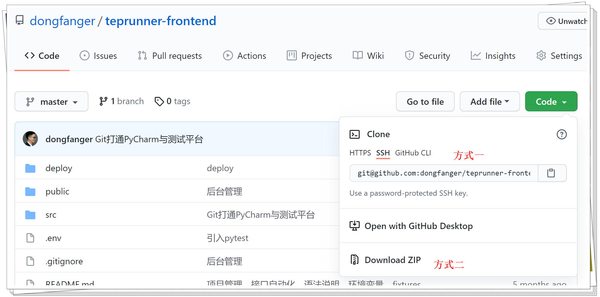

# teprunner-frontend

## 下载源码

方式①：

```
git clone git@github.com:dongfanger/teprunner-frontend.git
```

方式②：下载zip压缩包后解压。



## 安装依赖包

在项目目录打开cmd，执行命令：

```
npm install
```

## 启动服务

等待依赖包安装完成后，启动前端服务：

```
npm run serve
```

## 访问系统

打开浏览器，输入`localhost:8080`：


用户名`admin`，密码`qa123456`。此时还无法登陆，需要部署[后端服务]()。